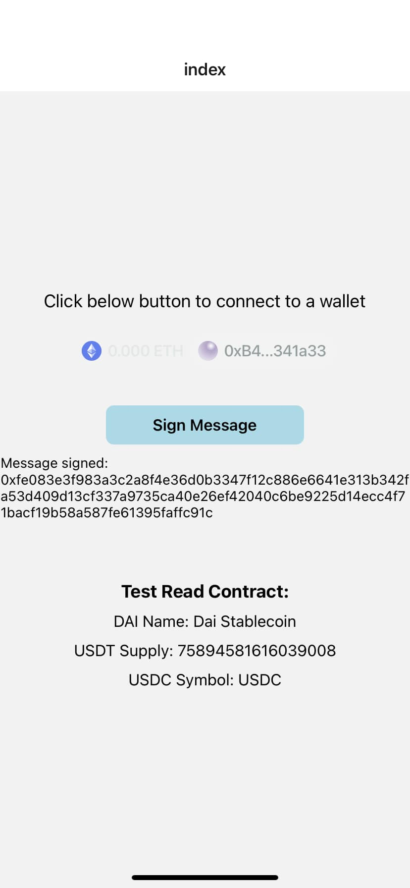

### react-native-wallet-connect
React Native Expo app: Connect to wallets, send Sign Message, read Smart Contract information.
Using Reown Appkit tool.



### Get started

1. Install dependencies

   ```bash
   npm install
   ```

2. Start the app

   ```bash
    npx expo start
   ```

### Learn more

To learn more about developing your project with Reown AppKit, look at the following resources:

- [Reown documentation](https://docs.reown.com/) 
- [React Native guides](https://docs.reown.com/appkit/react-native/core/installation).

### About

- Created by HuyHung Dinh
- GitHub: https://github.com/hu2di
- Email: hebitaxy@gmail.com
